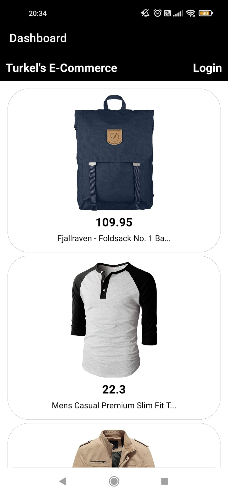
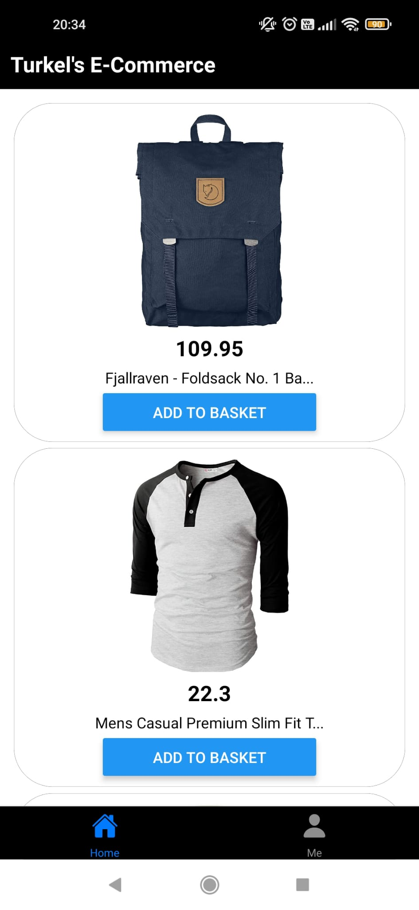
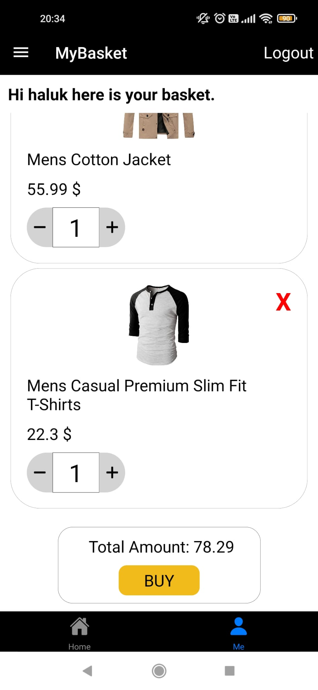
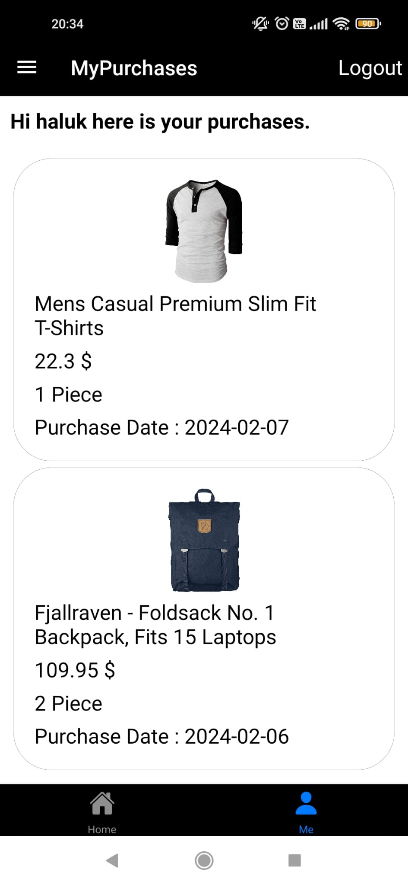

# native-ecommerce

This repo is the native app of fullstack Ecommerce-App. E-commerce-app is a fullstack project that you can see products and you can add product to your basket and buy products. When you buy products you can see them in your purchases.
To see web repo you can visit [Frontend-Ecommerce-App](https://github.com/Hasan-Turkel/ecommerce-next-frontend) and for the backend repo [E-commerce Backend](https://github.com/Hasan-Turkel/e-commerce-backend).

## This is how the site looks like.

